# *Alter Ego - Full-Stack E-Commerce Platform*

_A professional, full-stack e-commerce application tailored for the Alter Ego clothing brand. This project features a robust, scalable NestJS backend and a highly responsive Next.js frontend, engineered for seamless shopping, secure payments, and a premium user experience._

---

## *Target Audience*
This application **Alter Ego** brand looking for a fast, intuitive, and secure online shopping experience across both desktop and mobile devices.


## *photoshots*


<div style="display: flex; flex-wrap: wrap; gap: 15px;">

  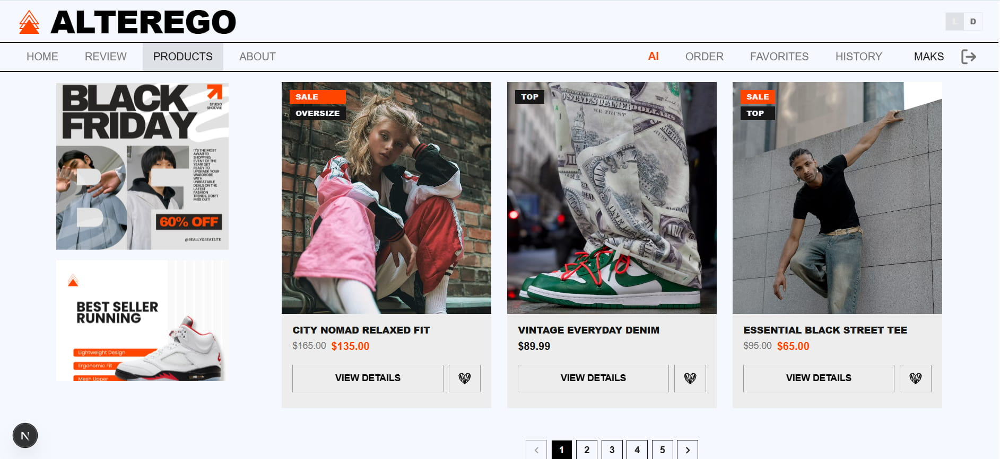
  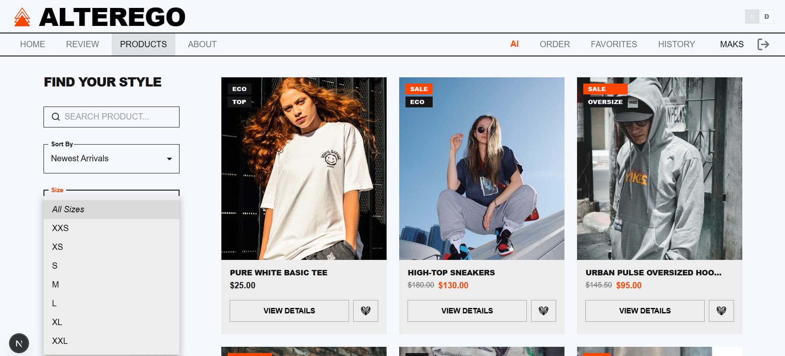
  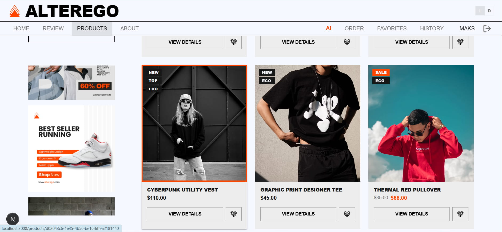
  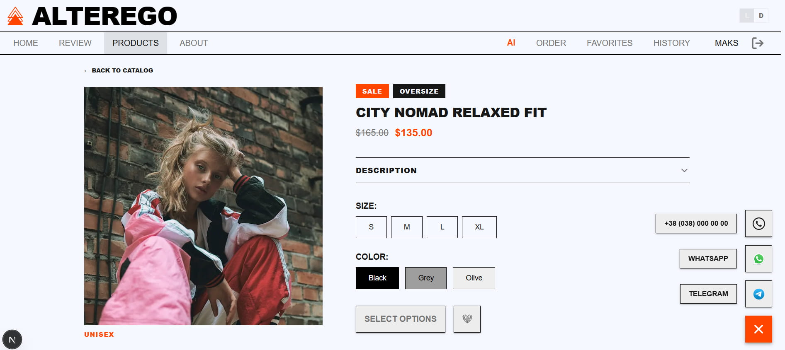
  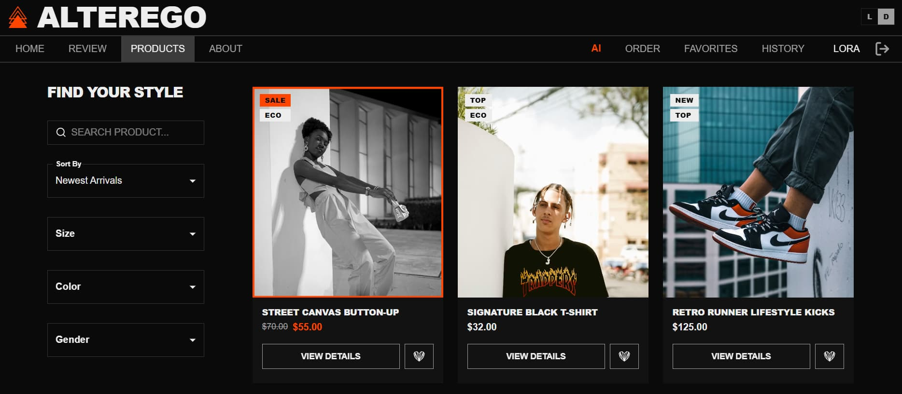
  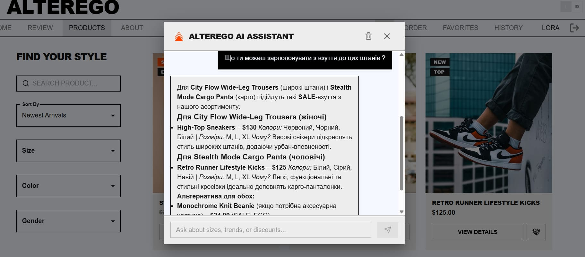
  
  
  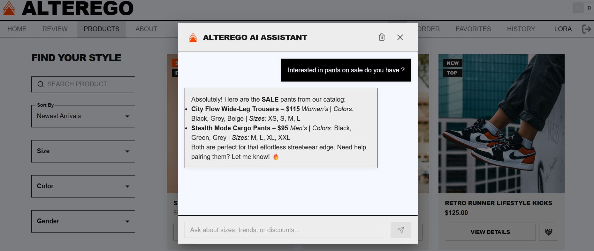
  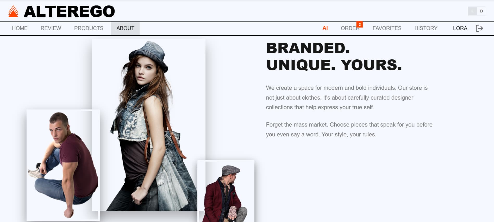
  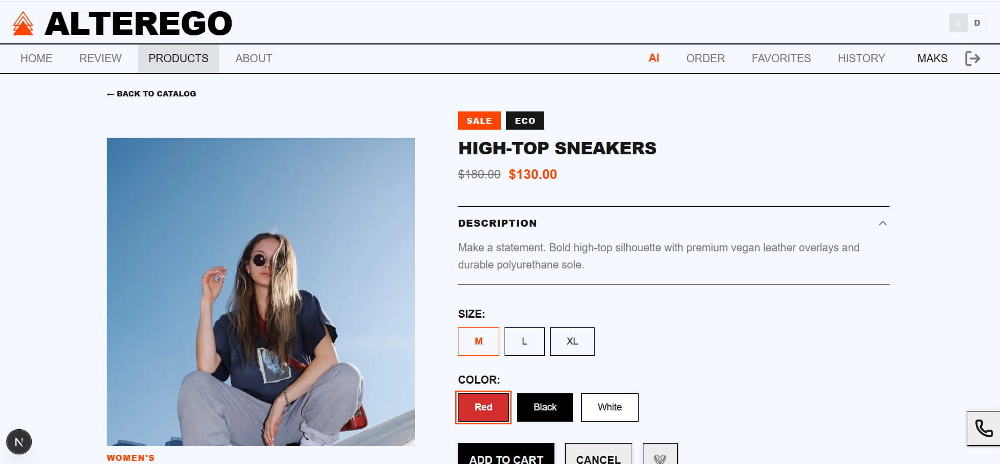
  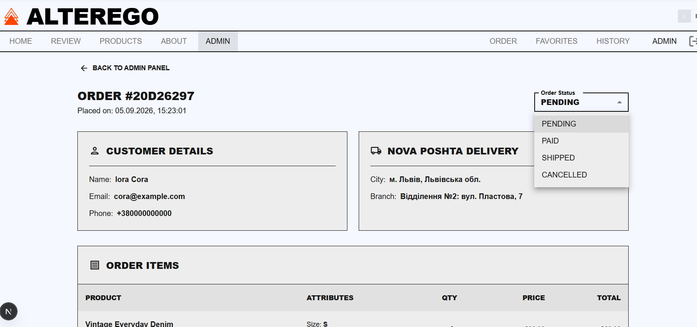
  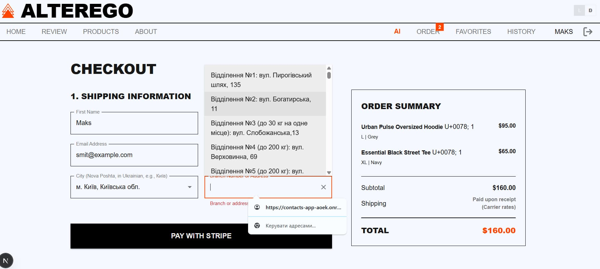
  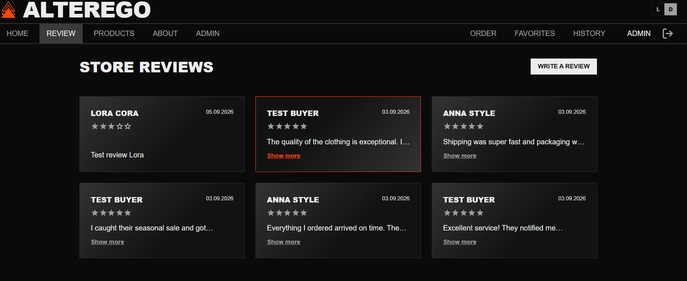
  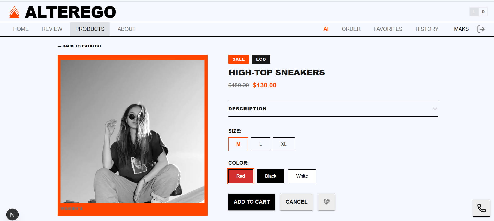
  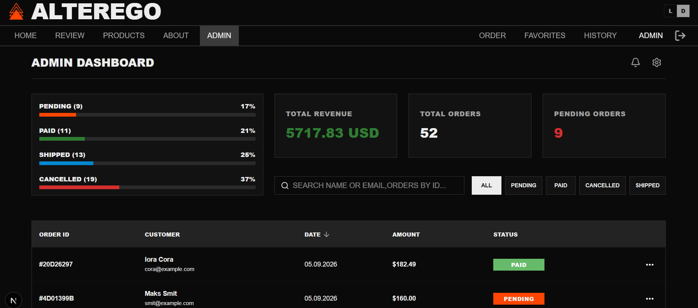
  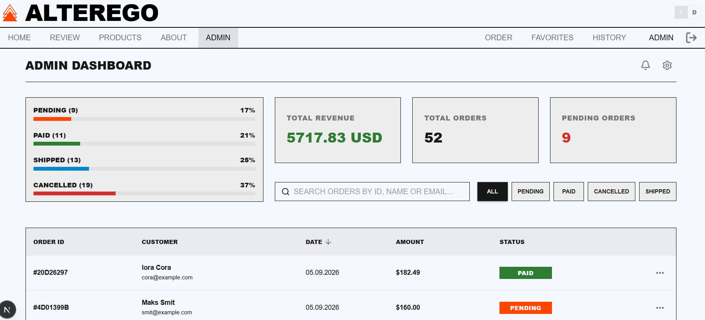
  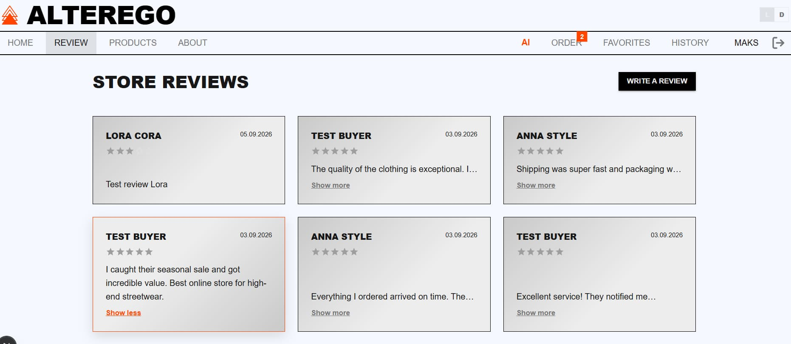
  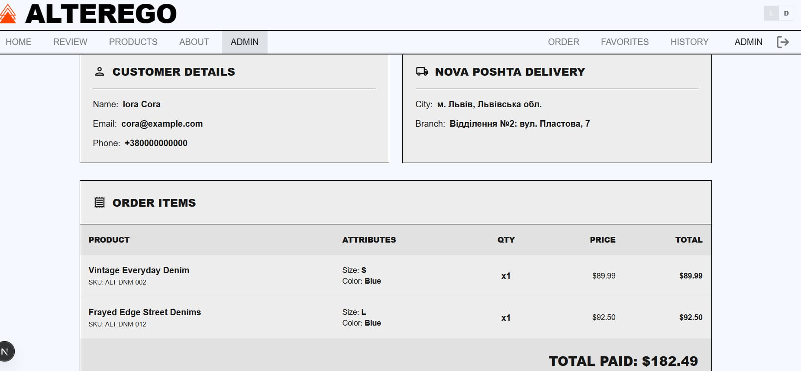
  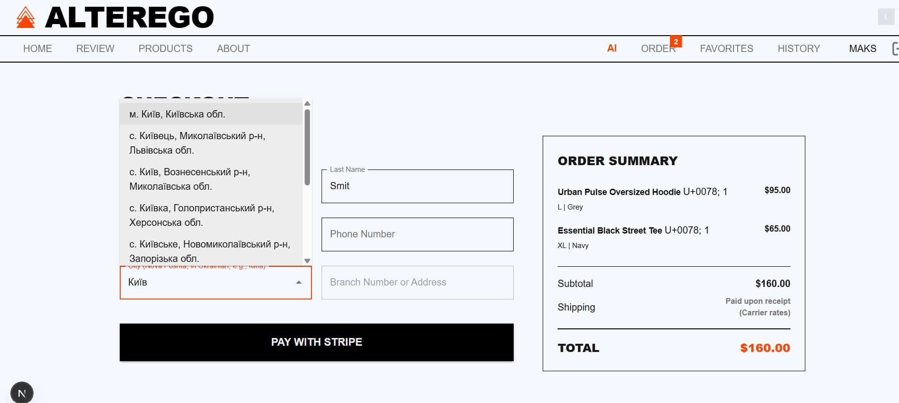
  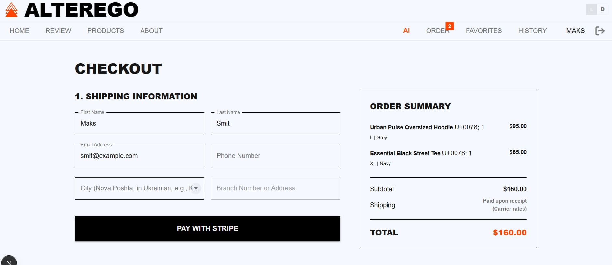
  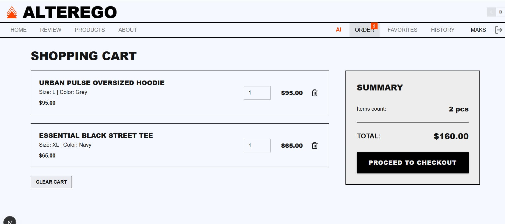
  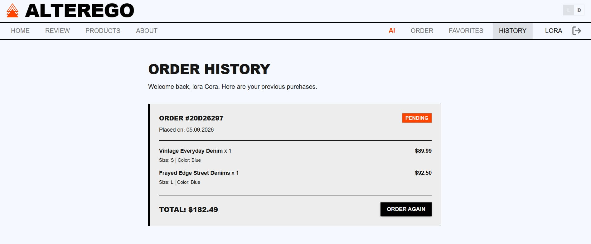
  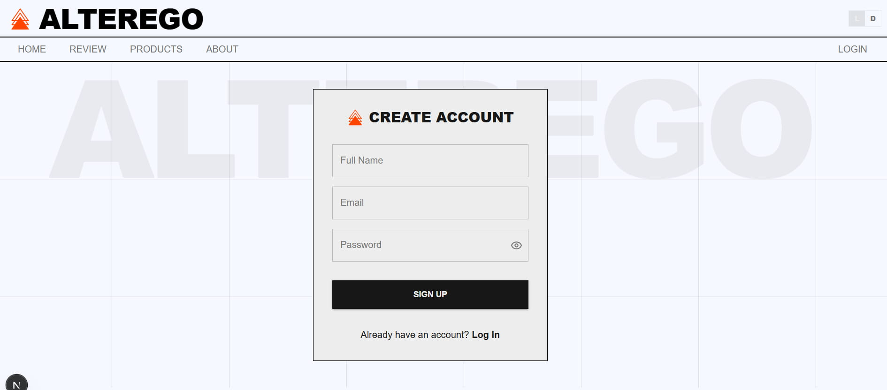
  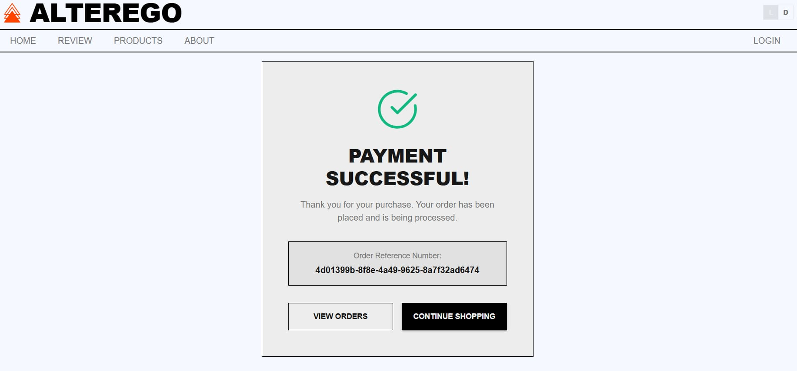

</div>

## *Key Features*

* **Comprehensive Shopping Flow:** Browse products on the main catalog, view specific item details on the **Product Page (by ID)**, and manage intended purchases.
* **User Authentication:** Secure **Login and Registration** pages utilizing JWT and Passport for safe user sessions.
* **Favorites (Wishlist):** A dedicated **Favorites page** allowing users to save and track their preferred clothing items for future purchases.
* **Advanced Checkout & Payments:** A streamlined **Checkout page** integrated with the **Stripe API** for secure, real-time credit card processing and transaction handling.
* **Nova Poshta Integration:** Seamless connection with the **Nova Poshta API** to fetch up-to-date cities and branch locations, ensuring accurate shipping details during checkout.
* **Order History:** A dedicated page where authenticated users can view their past purchases and order statuses.
* **Responsive & Accessible UI:** Fully responsive design featuring a dedicated **Mobile Menu** for smooth navigation on smaller photos.
* **Theming:** Integrated **Light and Dark mode** capabilities, allowing users to customize their visual experience.
* **Interactive API Documentation (Swagger):** Fully documented RESTful API with an interactive UI available via Swagger.
* **Admin Panel:** A secure **Admin Dashboard** for managing products, orders, and users.
* **Reviews Page:** A dedicated page for customer feedback and product reviews.
* **About Page:** Informational page describing the brand and its mission.
* **AI Assistant Integration:** Built-in AI assistant providing product recommendations and interactive guidance.

---

## Tech Stack & Architecture

This project is separated into a high-performance backend and a modern frontend, ensuring scalability and maintainability.

### Frontend (Client)
* **Framework:** Next.js (v16) & React (v19)
* **UI Components & Styling:** Material-UI (MUI v9) & Emotion
* **State Management:** Zustand
* **Form Handling & Validation:** React Hook Form & Yup
* **Icons & Notifications:** Lucide React, React Toastify
* **Animations:** Framer Motion
* **Markdown Rendering:** React Markdown

### Backend (Server)
* **Framework:** NestJS (v11)
* **Database & ORM:** PostgreSQL with Prisma (v7)
* **Authentication:** Passport.js, JWT, Bcrypt
* **Payment Processing:** Stripe SDK
* **API Documentation:** Swagger UI
* **Validation:** Class-validator & Class-transformer
* **Security:** Sanitize-html
* **Testing:** Jest & Supertest for unit and e2e tests

---

## Integrations

* **Stripe Sandbox:** Secure payment gateway with test and live transaction support.
* **Nova Poshta API:** Real-time shipping data for cities and branch locations.
* **AI Assistant (ALTEREGO AI):** Intelligent product recommendations and shopping guidance.

---

## Getting Started

Follow these instructions to set up the project locally. 

### 1. Clone the Repository

```bash
git clone https://github.com/USERNAME/REPOSITORY_NAME.git
cd REPOSITORY_NAME
# Navigate to the backend directory
cd apps/backend

# Install dependencies
npm install

# Set up environment variables
# Create a .env file and add your PostgreSQL URI, Stripe Secret Key, and JWT Secrets

# Seed the database with initial products/data
npm run seed

# Run the development server
npm run start:dev
# Open a new terminal and navigate to the frontend directory
cd apps/frontend

# Install dependencies
npm install

# Set up environment variables
# Create a .env.local file and add your backend API URL, Stripe Public Key, and Nova Poshta API Key

# Start the development server
npm run dev
